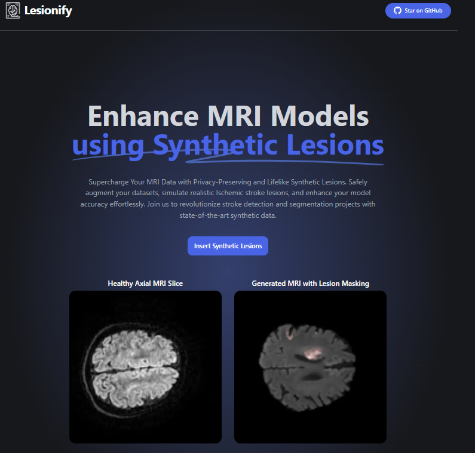

<<<<<<< HEAD
# 4catalyzer-hackathon

# TODO: 
- Document the installation of the diffusers package required
- Upload best checkpoints
=======
# [Lesionize](https://lesionize.io) - Synthetic Stroke Lesion Generation for MRI Data

[](https://vercel.com/new/clone?repository-url=https://github.com/Nutlope/strokeGPT&env=REPLICATE_API_KEY&project-name=stroke-GPT&repo-name=strokeGPT)

[](https://strokeGPT.io)

## How it works

StrokeGPT utilizes a latent diffusion model to generate synthetic stroke lesions that mimic those found in ischemic stroke patient MRI scans. This functionality is specifically designed to assist stroke detection and segmentation projects by providing augmented data for training and improving stroke detection models.

The application allows users to upload an image of an MRI scan. The uploaded images are then processed using the latent diffusion model through a Next.js API route, and the generated image with synthetic stroke lesions is returned to the user. The latent diffusion model is hosted on [Replicate](https://replicate.com), and [Upload](https://upload.io) is used for image storage.

## Running Locally

### Installing the dependencies.

```bash
npm install
```

### Running the application.

Then, run the application in the command line, and it will be available at `http://localhost:3000`.

```bash
npm run dev
```

## One-Click Deploy

Deploy the example using [Vercel](https://vercel.com?utm_source=github&utm_medium=readme&utm_campaign=vercel-examples):

[](https://vercel.com/new/clone?repository-url=https://github.com/Nutlope/strokeGPT&env=REPLICATE_API_KEY&project-name=stroke-GPT&repo-name=strokeGPT)
>>>>>>> 92871781360e793642c02f3a0c05ea0028256a7b
